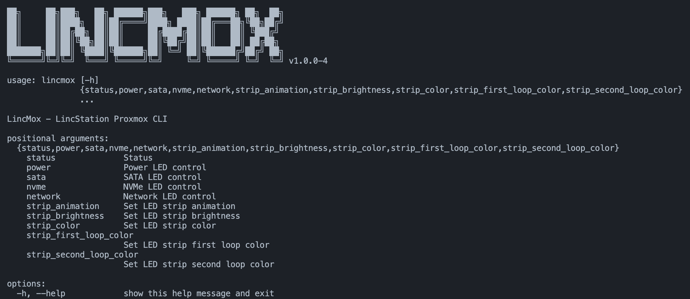

# LincMox - LincStation Proxmox Repo

[Full Documentation](https://doc.lincmox.ovh/)

## Screenshot

## Setup

gpg --full-generate-key

gpg --export-secret-keys GPG_KEY_ID > private.key

base64 -w0 private.key

chmod 600 private.key

gpg --export GPG_KEY_ID > public.key

base64 -w0 public.key

export DOCKER_BUILDKIT=1

chmod +x deploy.sh

./deploy.sh

## Installation

curl -fsSL https://repo.lincmox.ovh/public.key | sudo gpg --dearmor -o /usr/share/keyrings/lincmox.gpg

echo "deb [signed-by=/usr/share/keyrings/lincmox.gpg] https://repo.lincmox.ovh trixie main" | sudo tee /etc/apt/sources.list.d/lincmox.list

sudo apt update

sudo apt install lincmox-cli